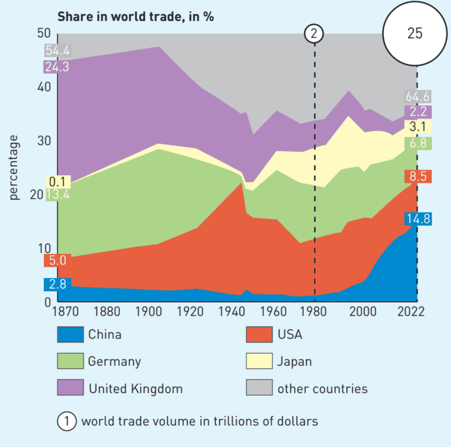
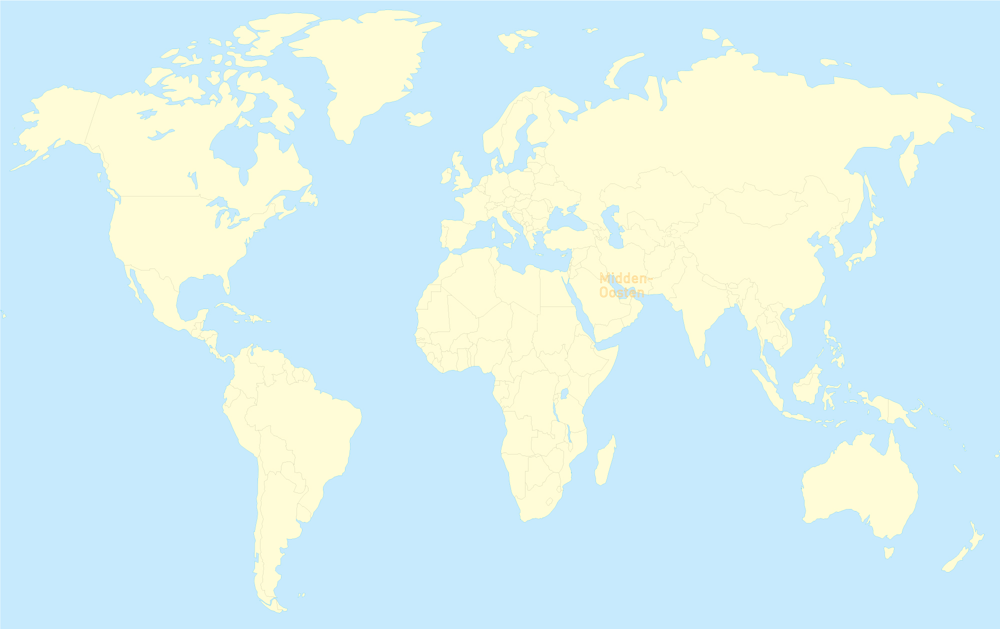
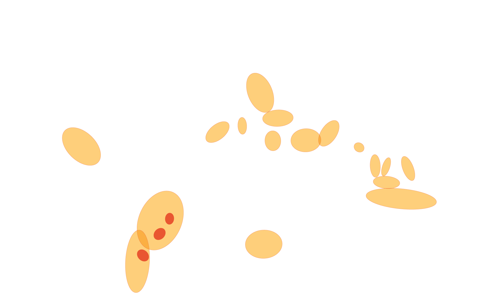
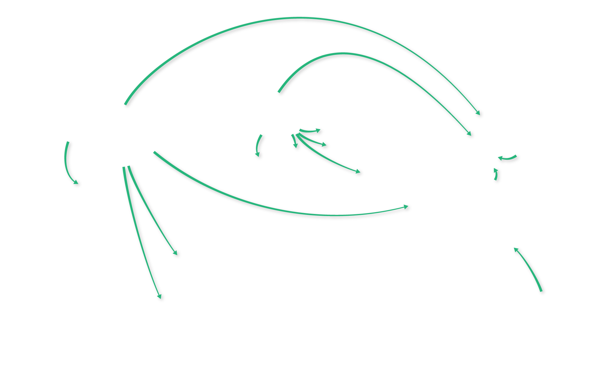
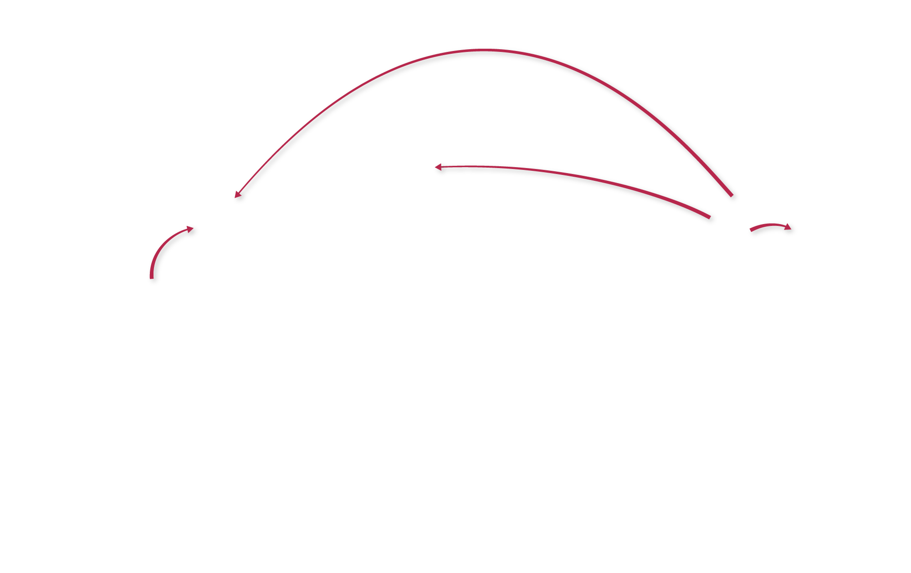
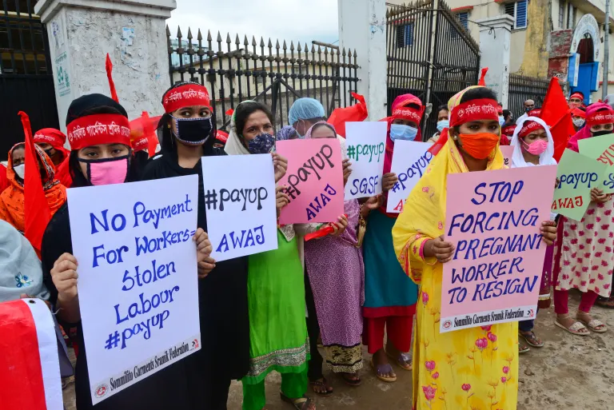

# Chapter 1: World trade in motion
*Hoofdstuk 1: Wereldhandel in beweging*

## §1.1 Is the economic world view shifting?
*§1.1 Verschuift het economische wereldbeeld?*

### Lesstof / Theory

*Werkwijze: De bron is een commercieel schoolboek. Daarom is de theorie hieronder beknopt en brongebonden weergegeven, niet woordelijk overgenomen. Er zijn geen eigen conclusies, verklaringen of antwoorden toegevoegd. De Engelse tekst is de oorspronkelijke taal; het Nederlands is een afzonderlijke vertaling van deze notities.*

Method: The source is a commercial textbook. The theory below is therefore represented in concise, source-grounded notes, not copied verbatim. No independent conclusions, explanations, or answers have been added. English is the original language; Dutch is a separate translation of these notes.

#### Introductie / Introduction

*De introductie vergelijkt Silicon Valley in de Verenigde Staten met snel groeiende technologiecentra in Bengaluru (India) en Shenzhen (China). Een smartphone kan in de Verenigde Staten zijn ontworpen en in Azië zijn gemaakt. De vraag is waar de economische zwaartepunten in de toekomst zullen liggen.*

The introduction compares Silicon Valley in the United States with rapidly growing technology hubs in Bengaluru, India, and Shenzhen, China. A smartphone may be designed in the United States and made in Asia. It asks where economic centres of gravity may lie in the future.

#### Productie van goederen verschuift / Goods production on the move

*De tekst beschrijft een verschuiving in de herkomst van industriële goederen: het aandeel uit de Verenigde Staten en Duitsland daalde tussen 1990 en 2023, terwijl het aandeel van landen in de semi-periferie toenam. Het aandeel van China nam volgens de tekst achtmaal toe ([bron 8](#source-8)).*

The text describes a shift in the origins of industrial goods: the share from the United States and Germany fell between 1990 and 2023, while the share from semi-periphery countries increased. China's share increased eightfold according to the text ([source 8](#source-8)).

*Multinationale ondernemingen (MNO's) dragen hieraan bij door delen van hun productie naar het buitenland te verplaatsen, vooral naar landen met lage lonen. Opkomende landen ontwikkelen daarnaast vaker producten en nemen meer diensten over. De tekst noemt China's nadruk op technologie en innovatie. Stijgende inkomens maken opkomende landen ook aantrekkelijkere afzetmarkten.*

Multinational organisations (MNOs) contribute by moving parts of their production abroad, especially to low-wage countries. Emerging countries are also increasingly developing products and taking on more services. The text notes China's emphasis on technology and innovation. Rising incomes also make emerging countries more attractive sales markets.

#### Handelsstromen verschuiven / Trade patterns are shifting

*Sinds 1980 is een deel van de wereldhandel verschoven van kernlanden naar periferie- en vooral semi-periferielanden. Veel goederen worden daar gemaakt voor hoge-inkomenslanden. De tekst noemt drie factoren achter de groei van de wereldhandel: productieketens zijn verdeeld over meerdere landen; vervoer is sneller en goedkoper geworden, onder meer door containers en ICT; en handelsbelemmeringen nemen af door vrijhandel.*

Since 1980, some world trade has shifted from core countries to countries in the periphery and especially the semi-periphery. Many goods are made there for high-income countries. The text names three factors behind world-trade growth: production chains are divided across countries; transport has become faster and cheaper, including through containers and ICT; and trade barriers have declined through free trade.

*Productie op verschillende plaatsen kan meer handel en vervoer veroorzaken en kan samengaan met slechte arbeidsomstandigheden ([bron 10](#source-10)). Sneller vervoer en moderne informatie- en communicatietechnologie kunnen levering volgens het just-in-timeprincipe ondersteunen. De Wereldhandelsorganisatie (WTO) wil vrijhandel verder bevorderen. De tekst noemt ook beperkingen en spanningen rond handel, waaronder Amerikaanse beperkingen op de export van chipmachines van ASML naar China in 2023 en hoge Amerikaanse invoertarieven vanaf 2025.*

Production in multiple locations can generate more trade and transport and may be associated with poor working conditions ([source 10](#source-10)). Faster transport and modern information and communication technology can support just-in-time delivery. The World Trade Organization (WTO) seeks to promote free trade further. The text also notes trade restrictions and tensions, including US restrictions on ASML chip-machine exports to China in 2023 and high US import tariffs from 2025.

*Sinds 1990 zijn gebieden in de wereld sterker met elkaar verbonden; de tekst noemt dit globalisering. Volgens de tekst waarschuwt het IMF dat deze verbindingen in de voorafgaande tien jaar een plateau bereikten.*

Since 1990, areas of the world have become more interconnected; the text calls this globalisation. According to the text, the IMF warns that this interconnection reached a plateau over the preceding ten years.

#### Mondiale verschuiving / Global shift

*De tekst beschrijft dat China en andere opkomende landen meer invloed hebben gekregen in de WTO. Europa en de Verenigde Staten blijven belangrijk voor de wereldeconomie, maar het economische zwaartepunt verschuift. Een multipolaire wereldeconomie is een economie met belangrijke economische kerngebieden op meerdere plaatsen in de wereld. De locaties van economische centra kunnen veranderen ([bron 9](#source-9)).*

The text describes China and other emerging countries gaining more influence in the WTO. Europe and the United States remain important to the world economy, but its economic centre of gravity is shifting. A multipolar world economy has important economic core areas in several places around the world. The locations of economic centres can change ([source 9](#source-9)).

*De tekst noemt reshoring als het terugbrengen van (een deel van) productie naar het land van herkomst. De redenen hiervoor worden aangekondigd als onderwerp van een volgende paragraaf en zijn daarom niet uitgewerkt in §1.1 ([kaart 9](#source-9)).*

The text defines reshoring as bringing (part of) production back to the home country. Its reasons are announced as a topic for a later paragraph and are therefore not developed in §1.1 ([map 9](#source-9)).

### Key terms / Begrippen

| English | Nederlands | Definition (EN) | Definitie (NL) |
|---|---|---|---|
| MNO (multinational organisation) | MNO (multinationale onderneming) | A company operating in more than one country. | Een onderneming die in meer dan één land actief is. |
| Offshoring | Offshoring (productie verplaatsen naar het buitenland) | Moving part of a company's activities or production to another country. | Een deel van de activiteiten of productie van een bedrijf naar een ander land verplaatsen. |
| Low-wage country | Lonenland / land met lage lonen | A country where labour costs are low. | Een land waar de loonkosten laag zijn. |
| Core, periphery, semi-periphery | Kern, periferie, semi-periferie | Positions of countries or regions in the world economy; the semi-periphery lies between the core and periphery in prosperity. | Posities van landen of gebieden in de wereldeconomie; de semi-periferie ligt qua welvaart tussen kern en periferie in. |
| Production chain | Productieketen | The linked stages and locations involved in producing a good. | De samenhangende stappen en plaatsen die betrokken zijn bij het maken van een product. |
| Just-in-time | Just-in-time | Delivering goods when they are needed, supported by transport and information systems. | Goederen leveren op het moment dat ze nodig zijn, ondersteund door vervoer en informatiesystemen. |
| Free trade | Vrijhandel | Trade with fewer restrictions between countries. | Handel tussen landen met minder belemmeringen. |
| WTO (World Trade Organization) | WTO (Wereldhandelsorganisatie) | An international organisation concerned with rules and the liberalisation of trade. | Een internationale organisatie die zich bezighoudt met handelsregels en het bevorderen van vrijhandel. |
| Globalisation | Globalisering | Increasing connections between areas of the world. | Het sterker verbonden raken van gebieden in de wereld. |
| Global shift | Mondiale verschuiving (global shift) | A shift in the world's economic centre of gravity. | Een verschuiving van het economische zwaartepunt in de wereld. |
| Multipolar world economy | Multipolaire wereldeconomie | A world economy with important economic core areas in several locations. | Een wereldeconomie met belangrijke economische kerngebieden op meerdere plaatsen. |
| Reshoring | Reshoring (productie terughalen) | Bringing some production back to the company's home country. | Een deel van de productie terugbrengen naar het land van herkomst van het bedrijf. |

### Verwezen afbeeldingen en bronnen / Referenced visuals

- **Source 8 — Trade volume and export of industrial goods (1870–2022). Used in:** §1.1 theory; Q1.1.3a–c; Q1.1.R1a–c. *De geopende afbeelding toont een gestapelde vlakgrafiek met het aandeel in de wereldhandel (%) op de verticale as en jaartallen 1870–2022 op de horizontale as. De legenda onderscheidt China, de VS, Duitsland, het Verenigd Koninkrijk, Japan en overige landen. Een tweede legenda-aanduiding geeft het totale wereldhandelsvolume in biljoenen dollars aan; een stippellijn markeert 1980. Afleesbare aandelen bij 1870: China 2,8%, VS 5,0%, Duitsland 13,4%, VK 24,3%, Japan 0,1%, overige landen 54,4%. Afleesbare aandelen bij 2022: China 14,8%, VS 8,5%, Duitsland 6,8%, VK 2,2%, Japan 3,1%, overige landen 64,6%. De cirkel bij 2022 geeft een wereldhandelsvolume van 25 biljoen dollar aan. Tussenliggende precieze waarden zijn niet overgenomen.*

  Source 8: The opened image is a stacked-area chart. The vertical axis is share of world trade (%) and the horizontal axis covers 1870–2022. The legend distinguishes China, the USA, Germany, the United Kingdom, Japan, and other countries. A second legend marker gives total world-trade volume in trillions of dollars; a dashed line marks 1980. Readable 1870 shares: China 2.8%, USA 5.0%, Germany 13.4%, UK 24.3%, Japan 0.1%, other countries 54.4%. Readable 2022 shares: China 14.8%, USA 8.5%, Germany 6.8%, UK 2.2%, Japan 3.1%, other countries 64.6%. The 2022 circle gives total world-trade volume as 25 trillion dollars. Exact intermediate values are not transcribed.

  

- **Source 9 — Old and new economic centres. Used in:** §1.1 theory; Q1.1.4c; Q1.1.6c. *De geopolitieke wereldkaart heeft een legenda voor oude markten die invloed verliezen (19e–20e eeuw), grote groeimarkten (eind 20e–begin 21e eeuw) en nieuwe, kleinere groeimarkten (eind 20e–begin 21e eeuw). Drie pijltypen geven een eerste fase van offshoring van goederenproductie, een tweede fase van offshoring en een fase van reshoring aan. De kaart labelt onder meer de VS, Canada, Mexico, Brazilië, Argentinië, West- en Oost-Europa, Rusland, Turkije, Marokko, Tunesië, Egypte, Midden-Oosten, Zuid-Afrika, Pakistan, Bangladesh, India, China, Thailand, Vietnam, Maleisië, Indonesië, Filipijnen, Taiwan, Japan en Australië. De kaart toont marktgroepen en productierichtingen; er zijn geen kwantitatieve waarden af te lezen.*

  Source 9: The geopolitical world map has a legend for old markets losing influence (19th–20th century), major growth markets (late 20th–early 21st century), and new, smaller growth markets (late 20th–early 21st century). Three arrow types indicate a first phase of goods-production offshoring, a second offshoring phase, and a reshoring phase. Labels include the USA, Canada, Mexico, Brazil, Argentina, Western and Eastern Europe, Russia, Turkey, Morocco, Tunisia, Egypt, the Middle East, South Africa, Pakistan, Bangladesh, India, China, Thailand, Vietnam, Malaysia, Indonesia, the Philippines, Taiwan, Japan, and Australia. The map shows market groups and production directions; it has no readable quantitative values.

  

    
    
    
    
    
    
    
    
  

- **Source 10 — Protest by clothing factory workers in Dhaka, Bangladesh. Used in:** §1.1 theory; Q1.1.3d. *De geopende foto toont een groep demonstranten buiten bij een hek; veel zichtbare demonstranten lijken vrouwen te zijn. Verschillende personen dragen hoofdbanden en mondkapjes en houden protestborden vast. Leesbare Engelse tekst op borden noemt onder meer geen betaling voor werknemers, gestolen loon/arbeid, “#payup” en druk op zwangere werknemers om ontslag te nemen. Dit is een beschrijving van de zichtbare foto; er is geen bronfotograaf of aanvullende attributie zichtbaar in het geopende beeld.*

  Source 10: The opened photograph shows a group of demonstrators outdoors near a gate; many visible demonstrators appear to be women. Several wear headbands and face masks and hold protest signs. Readable English text on signs refers to no payment for workers, stolen wages/labour, “#payup,” and pressure on pregnant workers to resign. This describes visible content only; no photographer credit or additional attribution is visible in the opened image.

  

- **Source 11 — Falling prices of Chinese solar panels. Used in:** Q1.1.4d. *Dit is een tekstbron en geen zelfstandig beeld. De getoonde passage gaat over dalende prijzen van zonnepanelen, China's rol in de productieketen en plannen van de EU om Europese productiecapaciteit op te bouwen. Zichtbare bronvermelding: NRC, 15 januari 2024.*

  Source 11: This is a text source, not a separate image. The displayed passage concerns falling solar-panel prices, China's role in the production chain, and EU plans to build European production capacity. Visible citation: NRC, 15 January 2024.

- **Source 12 — Surface area of logistics space (m²) and e-shoppers in the Netherlands. Used in:** Q1.1.5a–c. *De titel en thematiek zijn zichtbaar in het opdrachtpaneel, maar de bronnenviewer opent niet in deze browsersessie. De afbeelding, assen, legenda en waarden konden daardoor niet worden geïnspecteerd; trends en getallen zijn niet ingevuld.*

  Source 12: The title and topic are visible in the exercise panel, but the source viewer would not open in this browser session. The image, axes, legend, and values could not be inspected; no trend or figures are supplied.

- **Source 13 — Chinese cities and the growing middle class. Used in:** Q1.1.6a, c. *De opdracht noemt een kaart met Chinese steden en het bijschrift dat een snel groeiende middenklasse in dit soort steden woont. De bronnenviewer bleef onbereikbaar; de kaartlocaties, legenda en overige kaartinformatie konden niet worden geïnspecteerd.*

  Source 13: The exercise identifies a map of Chinese cities and a caption stating that a rapidly growing middle class lives in these kinds of cities. The source viewer remained inaccessible; city locations, legend, and other map information could not be inspected.

- **Source A — Robotisation in the manufacturing industry (enrichment exercise). Used in:** Q1.1.E1e–f. *De geopende staafgrafiek heet “Robotisation in the manufacturing industry” en geeft robots per 10.000 werknemers in 2023 weer. De zichtbare rangorde begint met Zuid-Korea, Singapore en China. Niet alle landlabels en waarden waren voldoende leesbaar om volledig vast te leggen.*

  Source A: The opened bar chart is titled “Robotisation in the manufacturing industry” and shows robots per 10,000 employees in 2023. The visible ranking begins with South Korea, Singapore, and China. Not all country labels and values were legible enough to record completely.

- **Source B — Worker inspects footballs in Sialkot, Pakistan (revision exercise). Used in:** Q1.1.R1d. *Alleen het bijschrift is in de opdrachtbron zichtbaar; de foto zelf is in deze herinspectie niet geopend.*

  Source B: Only the caption is visible in the revision exercise source panel; the photograph itself was not opened during this re-inspection.

**Asset status / Status afbeeldingsbestanden:** *De gebruiker heeft hergebruiktoestemming bevestigd. De assets van bron 8 en 10 en de basiskaart plus transparante kaartlagen van bron 9 zijn lokaal opgeslagen onder `media/` en hierboven gekoppeld. In de zichtbare bronweergave stond geen afzonderlijke maker- of licentievermelding voor deze afbeeldingen; herkomst is Noordhoff, buiteNLand 3 vwo Editie 5 English Edition + Bosatlas. De werkbladbronnen 12, 13 en A hadden in deze sessie geen toegankelijk afbeeldingsbestand; bron B's afbeelding is niet opgehaald.*

The user confirmed permission to reuse the images. The assets for sources 8 and 10 and the source 9 base map plus transparent layers are saved locally under `media/` and linked above. No separate creator or license notice was visible in the source viewer; provenance is Noordhoff, buiteNLand 3 vwo Editie 5 English Edition + Bosatlas. Exercise-source image files for sources 12, 13, and A were not accessible in this session; source B's image was not retrieved.

### Opdrachten / Exercises

**Scope note / Werkwijze:** De boekvragen zijn vanwege auteursrecht beknopt geparafraseerd, niet woordelijk gekopieerd. Er zijn geen antwoorden ingevuld, nagekeken of ingediend. Het boek toonde geen antwoorden zonder inzending; daarom zijn er geen boekantwoorden opgenomen. Zoals eerder gevraagd zijn geen eigen of voorgestelde antwoorden toegevoegd.

Exercise prompts are briefly paraphrased for copyright reasons, not copied verbatim. No answers were entered, checked, or submitted. The book did not display answers without submission, so no book answers are included. In line with the user's earlier preference, no independent or suggested answers have been added.

#### Exercise 1 / Opdracht 1

- **Q1.1.1a — Prompt / Vraag:** *Controleer het label in je eigen schoen en noteer in welk land deze is gemaakt.* / Check the label in your own shoe and note the country where it was made. **Response / Antwoordvorm:** persoonlijke bronwaarneming / personal observation. **Answer / Antwoord:** not available in book / niet beschikbaar in het boek.
- **Q1.1.1b — Prompt / Vraag:** *Koppel vijf begrippen (bbp per inwoner, beroepsbevolking, lagelonenlanden, MNO en semi-periferie) aan de bijbehorende definities.* / Match five terms (GDP per capita, labour force, low-wage countries, MNO, and semi-periphery) to their definitions. **Response / Antwoordvorm:** matching / combineren. **Answer / Antwoord:** not available in book / niet beschikbaar in het boek.

#### Exercise 2 / Opdracht 2

- **Q1.1.2a — Prompt / Vraag:** *Noem twee redenen waarom MNO's bijdragen aan de verandering van het economische wereldbeeld.* / Give two reasons why MNOs contribute to changes in the economic world view. **Response / Antwoordvorm:** short explanation / korte uitleg. **Answer / Antwoord:** not available in book / niet beschikbaar in het boek.
- **Q1.1.2b — Prompt / Vraag:** *Beoordeel vier uitspraken over de toenemende rol van periferie- en semi-periferielanden, productontwikkeling daar, offshoring en de richting waarin productie sinds 1980 is verplaatst.* / Classify four statements about the growing role of periphery and semi-periphery countries, product development there, offshoring, and the direction of production relocation since 1980. **Response / Antwoordvorm:** correct/incorrect classification / goed-foutbeoordeling. **Answer / Antwoord:** not available in book / niet beschikbaar in het boek.
- **Q1.1.2c — Prompt / Vraag:** *Leg uit waarom het tegenwoordig makkelijker is om kantoorwerk naar een andere plaats te verplaatsen dan vijftig jaar geleden.* / Explain why office work is easier to relocate today than it was fifty years ago. **Response / Antwoordvorm:** short explanation / korte uitleg. **Answer / Antwoord:** not available in book / niet beschikbaar in het boek.

#### Exercise 3 / Opdracht 3

- **Q1.1.3a — Prompt / Vraag:** *Gebruik [bron 8](#source-8) en kies drie oorzaken die de verschuiving in handelsstromen verklaren uit zes mogelijkheden.* / Use [source 8](#source-8) and select three causes of shifting trade patterns from six options. **Response / Antwoordvorm:** select three / drie keuzes. **Source limitation / Bronbeperking:** graph values/options were visible; full graph values are not transcribed / de grafiekwaarden zijn niet volledig vastgelegd. **Answer / Antwoord:** not available in book / niet beschikbaar in het boek.
- **Q1.1.3b — Prompt / Vraag:** *Vergelijk China's aandeel in de wereldhandel in 2022 met dat van de Verenigde Staten in 1963 en verklaar waarom China meer inkomsten had ([bron 8](#source-8)).* / Compare China's share of world trade in 2022 with the United States' share in 1963 and explain why China earned more ([source 8](#source-8)). **Response / Antwoordvorm:** explanation using source 8 / uitleg met bron 8. **Answer / Antwoord:** not available in book / niet beschikbaar in het boek.
- **Q1.1.3c — Prompt / Vraag:** *Vul een zin aan over de mondiale verschuiving, de verdeling van productieketens, de plaats waar onderdelen worden gemaakt en het gevolg voor de wereldhandel.* / Complete a sentence about the global shift, divided production chains, where components are made, and the effect on world trade. **Response / Antwoordvorm:** fill-in selection / invulkeuzes. **Answer / Antwoord:** not available in book / niet beschikbaar in het boek.
- **Q1.1.3d — Prompt / Vraag:** *Beschrijf een waarneembaar kenmerk van de groep demonstranten op [bron 10](#source-10) en geef een mogelijke sociaal-culturele verklaring voor het protest.* / Describe an observable feature of the demonstrators in [source 10](#source-10) and give a possible socio-cultural explanation for the protest. **Response / Antwoordvorm:** source observation plus explanation / bronwaarneming met uitleg. **Answer / Antwoord:** not available in book / niet beschikbaar in het boek.

#### Exercise 4 / Opdracht 4

- **Q1.1.4a — Prompt / Vraag:** *Gebruik kaart GB 252 in de Digitale Bosatlas om te bepalen welk land de grootste economie ter wereld heeft.* / Use map GB 252 in the Digital Bosatlas to identify the country with the world's largest economy. **Response / Antwoordvorm:** short answer from atlas / kort antwoord met atlas. **Source limitation / Bronbeperking:** atlas map was not opened / atlaskaart niet geopend. **Answer / Antwoord:** not available in book / niet beschikbaar in het boek.
- **Q1.1.4b — Prompt / Vraag:** *Beoordeel met een voorbeeld uit GB 252 of Rusland naast een militair-politieke wereldmacht ook een economische supermacht is.* / Assess, using an example from GB 252, whether Russia is an economic superpower as well as a military-political power. **Response / Antwoordvorm:** evidence-based judgement / oordeel met bewijs. **Source limitation / Bronbeperking:** atlas map was not opened / atlaskaart niet geopend. **Answer / Antwoord:** not available in book / niet beschikbaar in het boek.
- **Q1.1.4c — Prompt / Vraag:** *Gebruik [bron 9](#source-9) en een kaart uit de atlas om te verklaren waarom een multipolaire wereldeconomie niet op korte termijn ontstaat; vermeld eerst het kaartnummer.* / Use [source 9](#source-9) and an atlas map to explain why a multipolar world economy will not emerge quickly; give the map number first. **Response / Antwoordvorm:** map-based explanation / uitleg met kaart. **Source limitation / Bronbeperking:** source 9 and atlas map details unavailable in text view / details van bron 9 en atlaskaart niet beschikbaar in tekstweergave. **Answer / Antwoord:** not available in book / niet beschikbaar in het boek.
- **Q1.1.4d — Prompt / Vraag:** *Koppel [bron 11](#source-11) aan het best passende begrip uit deze paragraaf.* / Match [source 11](#source-11) to the best-fitting term from the paragraph. **Response / Antwoordvorm:** choose one term / kies één begrip. **Answer / Antwoord:** not available in book / niet beschikbaar in het boek.

#### Exercise 5 / Opdracht 5

- **Q1.1.5a — Prompt / Vraag:** *Beschrijf de ontwikkeling van het oppervlak aan logistieke ruimte tussen 2020 en 2021 volgens [bron 12](#source-12).* / Describe the change in logistics-space area between 2020 and 2021 using [source 12](#source-12). **Response / Antwoordvorm:** data observation / gegevens aflezen. **Source limitation / Bronbeperking:** graph values unreadable in text view / grafiekwaarden niet leesbaar in tekstweergave. **Answer / Antwoord:** not available in book / niet beschikbaar in het boek.
- **Q1.1.5b — Prompt / Vraag:** *Verklaar met [bron 12](#source-12) waarom het aantal distributiecentra in Nederland sterk groeide, ondanks just-in-timelevering.* / Use [source 12](#source-12) to explain why distribution centres in the Netherlands increased despite just-in-time delivery. **Response / Antwoordvorm:** explanation from data / uitleg met gegevens. **Source limitation / Bronbeperking:** graph values unreadable in text view / grafiekwaarden niet leesbaar in tekstweergave. **Answer / Antwoord:** not available in book / niet beschikbaar in het boek.
- **Q1.1.5c — Prompt / Vraag:** *Leid uit [bron 12](#source-12) een verband af tussen het aantal e-shoppers en hun groeipercentage en formuleer dit als een ‘hoe-meer … hoe-meer/minder …’-zin.* / Infer from [source 12](#source-12) the relationship between the number of e-shoppers and their growth rate, using a “the more …, the more/less …” sentence. **Response / Antwoordvorm:** describe relationship from data / verband formuleren met gegevens. **Source limitation / Bronbeperking:** graph values unreadable in text view / grafiekwaarden niet leesbaar in tekstweergave. **Answer / Antwoord:** not available in book / niet beschikbaar in het boek.

#### Exercise 6: Learning goals / Opdracht 6: Leerdoelen

- **Q1.1.6a — Prompt / Vraag:** *Gebruik [bron 13](#source-13) en de titel om uit te leggen waarom een Duitse autofabrikant op China inzet.* / Use [source 13](#source-13) and its title to explain why a German carmaker is betting on China. **Response / Antwoordvorm:** explain using map/source / uitleg met kaart/bron. **Source limitation / Bronbeperking:** map details unreadable in text view / kaartdetails niet leesbaar in tekstweergave. **Answer / Antwoord:** not available in book / niet beschikbaar in het boek.
- **Q1.1.6b — Prompt / Vraag:** *Noem drie ontwikkelingen die de verschuiving van handelsstromen mogelijk hebben gemaakt en versterkt.* / Name three developments that enabled and reinforced shifts in trade patterns. **Response / Antwoordvorm:** list three / noem er drie. **Answer / Antwoord:** not available in book / niet beschikbaar in het boek.
- **Q1.1.6c — Prompt / Vraag:** *Haal uit [bron 13](#source-13) één aanwijzing op de kaart en één uit het bijschrift voor een multipolaire wereldeconomie; leg daarna het verband met [bron 9](#source-9) uit.* / Identify one clue in [source 13](#source-13)'s map and one in its caption for a multipolar world economy, then explain the connection to [source 9](#source-9). **Response / Antwoordvorm:** combine two sources / combineer twee bronnen. **Source limitation / Bronbeperking:** map contents of sources 13 and 9 unreadable / kaartinhoud van bronnen 13 en 9 niet leesbaar. **Answer / Antwoord:** not available in book / niet beschikbaar in het boek.

#### Revision exercise 1 / Herhalingsoefening 1

- **Q1.1.R1a — Prompt / Vraag:** *Koppel oorzaken (waaronder een verdeelde productieketen, stijgende welvaart, verplaatste productie en betere ICT) aan gevolgen of begrippen (waaronder global shift, just-in-time, offshoring, een grotere afzetmarkt en meer wereldhandel).* / Match causes (including divided production chains, rising prosperity, relocated production, and improved ICT) to outcomes or terms (including global shift, just-in-time, offshoring, a larger sales market, and more world trade). **Response / Antwoordvorm:** matching / combineren. **Answer / Antwoord:** not available in book / niet beschikbaar in het boek.
- **Q1.1.R1b — Prompt / Vraag:** *Vergelijk in [bron A](#source-a) de ontwikkeling van China sinds 1980 met die van de kernlanden en benoem het soort relatie.* / Compare China's development since 1980 with that of core countries in [source A](#source-a) and name the relationship. **Response / Antwoordvorm:** identify a relationship / benoem een relatie. **Answer / Antwoord:** not available in book / niet beschikbaar in het boek.
- **Q1.1.R1c — Prompt / Vraag:** *Vul een tekst aan over loonverschillen, offshoring, lagewaardewerk, global shift, semi-periferie en de verandering van het wereldhandelsvolume.* / Complete a passage about wage differences, offshoring, low-value production, global shift, the semi-periphery, and changes in world-trade volume. **Response / Antwoordvorm:** fill-in selections / invulkeuzes. **Answer / Antwoord:** not available in book / niet beschikbaar in het boek.
- **Q1.1.R1d — Prompt / Vraag:** *Kies welk begrip wordt geïllustreerd door [bron B](#source-b), een afbeelding van een werknemer die voetballen inspecteert in Sialkot, Pakistan.* / Choose the term illustrated by [source B](#source-b), an image of a worker inspecting footballs in Sialkot, Pakistan. **Response / Antwoordvorm:** choose a term / kies een begrip. **Answer / Antwoord:** not available in book / niet beschikbaar in het boek.
- **Q1.1.R1e — Prompt / Vraag:** *Kies welke uitspraak de doelen van de WTO, vrijhandel en globalisering juist met elkaar verbindt.* / Select the statement that correctly connects the WTO's aims, free trade, and globalisation. **Response / Antwoordvorm:** multiple choice / meerkeuze. **Answer / Antwoord:** not available in book / niet beschikbaar in het boek.

#### Enrichment exercise 1 / Verrijkingsoefening 1

- **Q1.1.E1a — Prompt / Vraag:** *Gebruik GB 253B om een economische reden te geven waarom een Britse kledingproducent productie van Thailand naar een ander Aziatisch land wil verplaatsen.* / Use GB 253B to give an economic reason why a British clothing producer might move production from Thailand to another Asian country. **Response / Antwoordvorm:** explain using atlas / uitleg met atlas. **Source limitation / Bronbeperking:** atlas map not opened / atlaskaart niet geopend. **Answer / Antwoord:** not available in book / niet beschikbaar in het boek.
- **Q1.1.E1b — Prompt / Vraag:** *Kies tussen India en China als mogelijke productielocatie en geef één geografische en één sociaal-culturele reden.* / Choose India or China as a production location and give one geographical and one socio-cultural reason. **Response / Antwoordvorm:** justified choice / keuze met redenen. **Answer / Antwoord:** not available in book / niet beschikbaar in het boek.
- **Q1.1.E1c — Prompt / Vraag:** *Kies op GB 252 de kaart die het beste laat zien dat India en China belangrijker worden in de wereldhandel en onderbouw je keuze met kaartinformatie.* / Choose the GB 252 map that best shows India's and China's growing importance in world trade and support the choice with map evidence. **Response / Antwoordvorm:** choose and justify a map / kaart kiezen en onderbouwen. **Source limitation / Bronbeperking:** atlas maps not opened / atlaskaarten niet geopend. **Answer / Antwoord:** not available in book / niet beschikbaar in het boek.
- **Q1.1.E1d — Prompt / Vraag:** *Noem naast China de twee Aziatische landen of gebieden met de grootste jaarlijkse groei in handelsvolume volgens GB 252.* / Name the two Asian countries or areas, besides China, with the greatest annual growth in trade volume according to GB 252. **Response / Antwoordvorm:** two short answers / twee korte antwoorden. **Source limitation / Bronbeperking:** atlas map not opened / atlaskaart niet geopend. **Answer / Antwoord:** not available in book / niet beschikbaar in het boek.
- **Q1.1.E1e — Prompt / Vraag:** *Gebruik [bron A](#source-a) om het land met het hoogste aantal industriële robots te bepalen en geef een economische verklaring.* / Use [source A](#source-a) to identify the country with the highest number of industrial robots and give an economic explanation. **Response / Antwoordvorm:** read chart and explain / grafiek aflezen en uitleggen. **Source note / Bronnotitie:** the visible chart ranks South Korea highest / in de zichtbare grafiek staat Zuid-Korea bovenaan. **Answer / Antwoord:** not available in book / niet beschikbaar in het boek.
- **Q1.1.E1f — Prompt / Vraag:** *Leg uit hoe robotisering in kernlanden kan bijdragen aan het terughalen van productie.* / Explain how robotisation in core countries could contribute to bringing production back. **Response / Antwoordvorm:** cause-and-effect explanation / oorzaak-gevolguitleg. **Answer / Antwoord:** not available in book / niet beschikbaar in het boek.

### Leerdoelen / Learning goals

*De pagina noemt drie leerdoelen: met een kaart uitleggen hoe een multipolaire wereldeconomie er in de toekomst uit kan zien; het verband begrijpen tussen globalisering en verschuivende handelsstromen; en weten waarom het economische wereldbeeld verandert.*

The page lists three learning goals: explain with a map what a multipolar world economy might look like in the future; understand the connection between globalisation and shifting trade patterns; and know why the economic world view is changing.

## Samenvatting / Summary (At a glance)

- *Niet opgenomen: de hoofdstukpagina's “At a glance” en “Summary” gaan over hoofdstuk 1 als geheel, terwijl deze extractie beperkt is tot §1.1.*
- Not included: the chapter-level “At a glance” and “Summary” pages cover Chapter 1 as a whole, while this extraction is limited to §1.1.

## Extractienotities / Extraction notes

- *Paragraaf behandeld: §1.1, “Is the economic world view shifting?” Eén Theory-unit (“Goods production on the move”) en de introductie/leerdoelen zijn gelezen.*
- Paragraph covered: §1.1, “Is the economic world view shifting?” One Theory unit (“Goods production on the move”), the introduction, and the learning goals were read.
- *Acht oefengroepen zijn geïnspecteerd: Exercise 1–6, Revision exercise 1, Enrichment exercise 1. In totaal zijn 30 vraagonderdelen vastgelegd. Geen antwoorden werden getoond zonder inzending; er zijn geen antwoorden ingediend.*
- Eight exercise groups were inspected: Exercise 1–6, Revision exercise 1, and Enrichment exercise 1. A total of 30 question parts were recorded. No answers were shown without submission; none were submitted.
- *Bij deze herinspectie zijn de beelden van bron 8, 9 en 10 en bron A geopend en beschreven. Alleen de duidelijk leesbare eindwaarden van bron 8 zijn genoteerd. Bron 12 en 13 konden niet via het opdrachtbronnenpaneel worden geopend; de bijbehorende hiaten en afhankelijke vragen zijn gemarkeerd. De Digitale Bosatlas-kaarten zijn niet geopend en blijven een beperking voor vragen die ernaar verwijzen.*
- During this re-inspection, the images for sources 8, 9, and 10 and source A were opened and described. Only clearly legible endpoint values from source 8 were recorded. Sources 12 and 13 could not be opened through the exercise source panel; those gaps and dependent questions are marked. Digital Bosatlas maps were not opened and remain a limitation for questions that refer to them.
- *De commerciële boektekst en vragen zijn niet woordelijk overgenomen. De Nederlandse tekst is een vertaling van beknopte bronnotities en geparafraseerde vraagbeschrijvingen, geen officiële vertaling. Er zijn geen eigen of voorgestelde antwoorden toegevoegd op verzoek.*
- Commercial textbook prose and questions were not copied verbatim. The Dutch text translates concise source notes and paraphrased question descriptions; it is not an official translation. No independent or suggested answers were added, as requested.
- *Geen vertalingen zijn als onzeker gemarkeerd. Er is niets ingevuld, nagekeken of gewijzigd in het account.*
- No translations were flagged as uncertain. Nothing was entered, checked, or changed in the account.
- *Er zijn geen afbeeldingsbestanden opgeslagen: hergebruikrechten voor het commerciële lesmateriaal zijn niet bevestigd. De bronrecords bevatten beschrijvingen en verwijzingen, geen lokale kopieën.*
- No image files were saved because reuse permission for the commercial textbook material was not confirmed. The visual records contain descriptions and references, not local copies.
